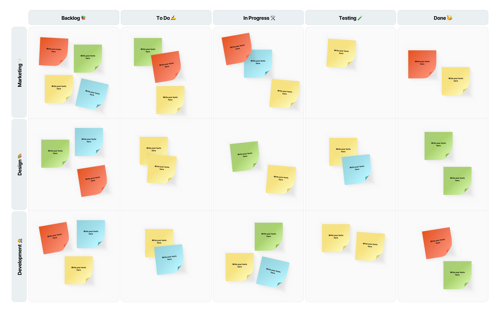

## Dive Weather Malta

> Stormglass.io is a web service which provides detailed marine weather information. We want to display that information in a single view so that a user can easily interpret and make use of it

#### Available data

- Temperature (Air & Water)
- Air Pressure
- Cloud Cover
- Wind (Direction, Speed, Gust)
- Humidity
- Rain
- Swell (Direction & Height)
- Visibility

#### Features

- Open Source brief &amp; project management
